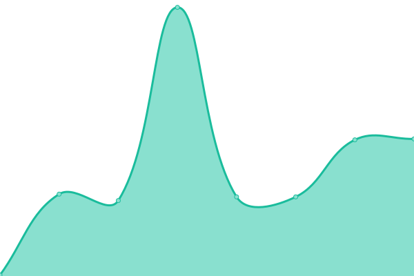

# [📈 Live Status](https://zowievangeest.github.io/voorhoede-support-upptime): <!--live status--> **🟩 All systems operational**

This repository contains the open-source uptime monitor and status page for [Zowie van Geest](https://zowievangeest.nl), powered by [Upptime](https://github.com/upptime/upptime).

With [Upptime](https://upptime.js.org), you can get your own unlimited and free uptime monitor and status page, powered entirely by a GitHub repository. We use [Issues](https://github.com/zowievangeest/voorhoede-support-upptime/issues) as incident reports, [Actions](https://github.com/zowievangeest/voorhoede-support-upptime/actions) as uptime monitors, and [Pages](https://zowievangeest.github.io/voorhoede-support-upptime) for the status page.

<!--start: status pages-->
<!-- This summary is generated by Upptime (https://github.com/upptime/upptime) -->
<!-- Do not edit this manually, your changes will be overwritten -->
<!-- prettier-ignore -->
| URL | Status | History | Response Time | Uptime |
| --- | ------ | ------- | ------------- | ------ |
|  [Voorhoede](https://www.voorhoede.nl/nl/) | 🟩 Up | [voorhoede.yml](https://github.com/zowievangeest/voorhoede-support-upptime/commits/HEAD/history/voorhoede.yml) | 

 386ms
     
 | 

<a href="https://zowievangeest.github.io/voorhoede-support-upptime/history/voorhoede">100.00%</a>
    

|  [Voorhoede Support](https://support.voorhoede.nl) | 🟩 Up | [voorhoede-support.yml](https://github.com/zowievangeest/voorhoede-support-upptime/commits/HEAD/history/voorhoede-support.yml) | 

 220ms
     
 | 

<a href="https://zowievangeest.github.io/voorhoede-support-upptime/history/voorhoede-support">100.00%</a>
    

<!--end: status pages-->

[**Visit our status website →**](https://zowievangeest.github.io/voorhoede-support-upptime)

## 📄 License

- Code: [MIT](./LICENSE) © [Zowie van Geest](https://zowievangeest.nl)
- Data in the `./history` directory: [Open Database License](https://opendatacommons.org/licenses/odbl/1-0/)
